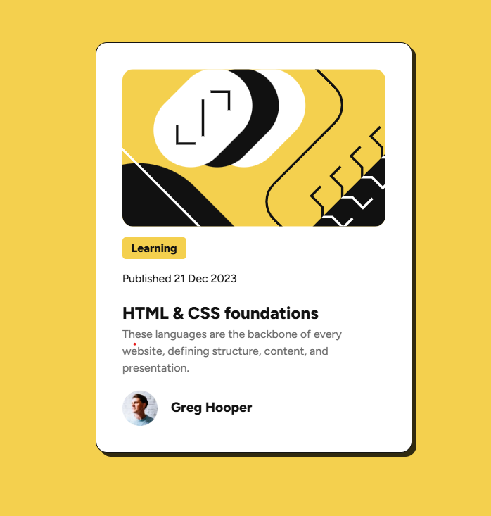

# Frontend Mentor - Blog preview card solution

This is a solution to the [Blog preview card challenge on Frontend Mentor](https://www.frontendmentor.io/challenges/blog-preview-card-ckPaj01IcS). Frontend Mentor challenges help you improve your coding skills by building realistic projects.

## Overview

### The challenge

Users should be able to:

- See hover and focus states for all interactive elements on the page

### Screenshot

### Live Demo

- Live Site URL: https://mcodes23.github.io/html-css-js-projects/blog-preview-card/

### Built with

- HTML5
- CSS3 (Flexbox, CSS Variables)

### what i learned

- Practiced mobile-first design.
- Improved usage of CSS variables.
- Strengthened layout skills using Flexbox.
