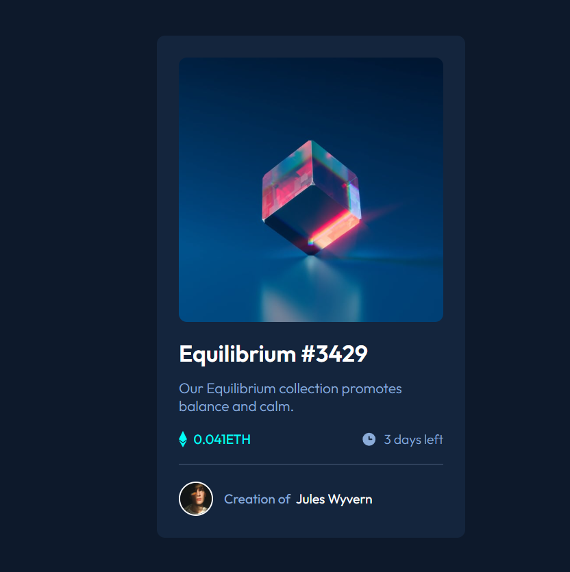

# Frontend Mentor - NFT preview card component solution

This is a solution to the [NFT preview card component challenge on Frontend Mentor](https://www.frontendmentor.io/challenges/nft-preview-card-component-SbdUL_w0U). Frontend Mentor challenges help you improve your coding skills by building realistic projects.

## Overview

### The challenge

Users should be able to:

- View the optimal layout depending on their device's screen size
- See hover states for interactive elements (image overlay, title, and creator name)

### Screenshot



### Links

- Live Site URL: https://mcodes23.github.io/html-css-js-projects/nft-preview-card-component/

### Built with

- Semantic HTML5 markup
- CSS custom properties
- Flexbox
- Mobile-first workflow

### What I learned

A key takeaway for me was handling **absolute positioning inside a container**.  
If an element is positioned `absolute`, the parent container should be set to `relative` to avoid anchoring to the body.

```html
<div class="img-container">
  
  <div class="overlay">
    
  </div>
</div>
```

```css
.img-container {
  position: relative;
  border-radius: 12px;
  overflow: hidden;
}

.img-container img {
  display: block;
  width: 100%;
  border-radius: 12px;
}

.overlay {
  position: absolute;
  bottom: 0;
  left: 0;
  right: 0;
  height: 0;
  background-color: rgba(0, 255, 247, 0.5);
  transition: height 0.5s ease;
  display: flex;
  align-items: center;
  justify-content: center;
}
```

### Useful resources

- [w3schools](https://www.w3schools.com/howto/howto_css_image_overlay_slide.asp) - This helped to implement the overlay hover effect to my image.
