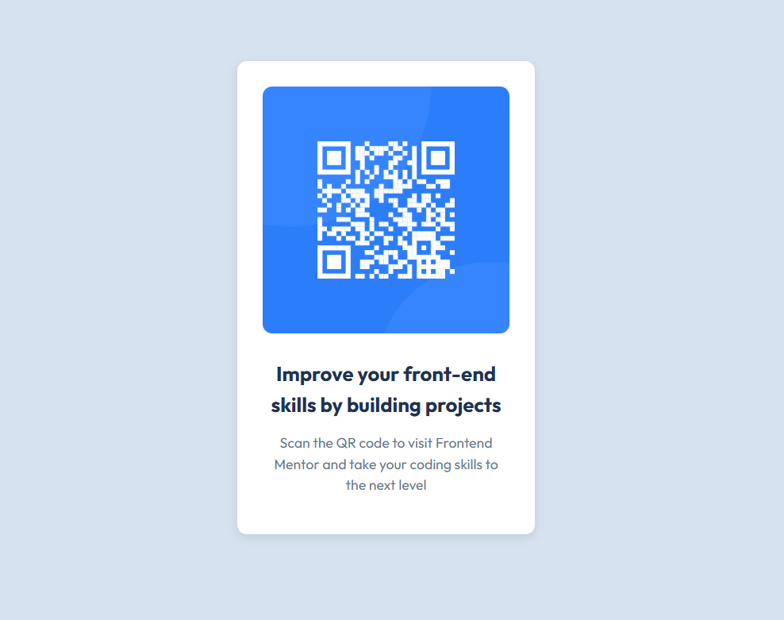

# QR Code Component

### Overview

A simple QR code component built with HTML & CSS as part of the Frontend Mentor(https://www.frontendmentor.io/challenges/qr-code-component-iux_sIO_H)
challenge.

### Features

1. Responsive mobile-first design

2. Centered card layout with Flexbox

3. Google Fonts integration

4. Clean, reusable CSS variables

## Screenshot

### Built With

- HTML5
- CSS3 (Flexbox, CSS Variables)

### live Demo

https://mcodes23.github.io/html-css-js-projects/qr-code-component/

### What I Learned

- Practiced mobile-first design.
- Improved usage of CSS variables.
- Strengthened layout skills using Flexbox.
