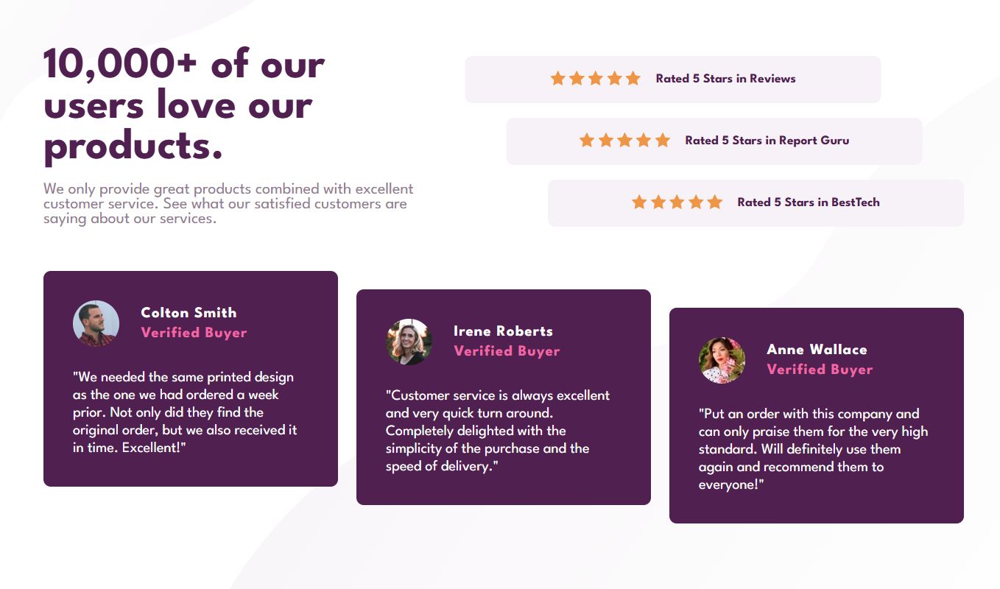

# Frontend Mentor - Social proof section solution

This is a solution to the [Social proof section challenge on Frontend Mentor](https://www.frontendmentor.io/challenges/social-proof-section-6e0qTv_bA). Frontend Mentor challenges help you improve your coding skills by building realistic projects and applying responsive design principles.

### The challenge

Users should be able to:

- View the optimal layout for the section depending on their device's screen size

### Screenshot



### Links

- Live Site URL: https://mcodes23.github.io/html-css-js-projects/social-proof-section/

### Built with

- Semantic HTML5 markup
- CSS custom properties
- Flexbox
- CSS Grid
- Mobile-first workflow

### What I learned

This project helped me strengthen my understanding of CSS Grid layouts and responsive design. I also practiced combining multiple background images and using grid-template-areas for layout control.

Here’s a snippet that I’m proud of — my responsive grid setup:

```css
.main-container {
  max-width: 1000px;
  display: grid;
  grid-template-areas:
    "main-text ratings"
    "reviews reviews";
  grid-template-columns: 1fr 1fr;
  gap: 3rem;
  column-gap: 6rem;
}
```
